# My Memory
## A game site built for testing your memory
### MS1 - Christopher Moreton

## **[Live site](https://chris-moreton12.github.io/my-memory/)**

------------------------------------------------------------------

## **[Repository](https://github.com/Chris-moreton12/my-memory)**

------------------------------------------------------------------

## Table of contents

 1. [ UX ](#ux)
 2. [ Features ](#features)  
 3. [ Features Left to Implement ](#left)  
 4. [ Technology used ](#tech) 
 5. [ Testing ](#testing)  
 6. [ Bugs ](#bugs)  
 7. [ Deployment](#deployment)
 8. [ Credits](#credits)
 9. [ Content](#content)  
 10. [ Acknowledgements](#acknowledgements)  

 ## UX

 

 ### Pre-project Planning
> Before starting this project, I had a look over some examples from previous students and some examples that were given to me as part of Code Institutes learning sessions. I took inspiration for ideas and came up with the plan to create a memory game which tests memory but also perseverance with the chance to fail the game at any point.

# UX design

## Strategy Plane

### To determine the best approach to this project I started with researching the needs of a game built to satify the player and allow them to enjoy the creation.

## User Stories

### User
> As a user I would like to be able to play a game that tests my memory that is quick, easy and fun to play.  
> As a user I would like this game to be challenging without excluding the fun. I would like to be able to play on my mobile device with ease.
> As a user I would like to be able to be tested but I would like to be able to play the game over again without knowing where each card will be.

### Webite Owner
> As a game developer, I would like my users ot have fun whilst playing my game, I would like my users to be challenged and I would like the game to be played over again without the user finding it boring.
> As a game developer, I would like my users to be able to play this game on multiple different devices with ease.
>The purpose of this game is to ensure that users can have fun and be challenged at times. The game can test patinnce and skill along with memory. The value that this site has to users is that they can play this game with ease on any device and still enjoy the layout without it being affected by screen size.

## Scope Plane
> The game should be easy to understand how the game works without the need for rules, however for accessibility, the game will display rules upon entering the site.  
> The game should have a welcome message which describes the rules of the game once the user enters the site.
> The game should display a selection of cards each faced down and each card should turn once clicked, a maximum of 2 cards should be able to be turned and if the cards match, they remain turned if they do not, the return to their default state.
> The game should be able to be played on multipe devices and the images should adjust relatively to each screen size.

## Structure Plane
> To achieve the above goals, a game will be created which will show 15 cards, these cards will include 7 pairs and one fail card which ends the game. Upon clicking the cards, they shall turn and show the picture on the reverse side. If 2 cards are clicked which match, these shall remain turned. If 2 cards are clicked which do not match, they shall return face down. The game is complete once all 7 pairs are found by avoiding the fail card. Due to there being a fail card, there will be no countdown on lives (unlimited). 

**Home Page**
> The one page that will be displayed will have all 15 cards displayed along with a header and a footer. The header has the title and a toggle button to change the game from light to dark mode for accessibility, the header also showcases a restart game button which allows the user to head back to the instructions section.

## Skeleton Plane

### Home Page Desktop Wireframe
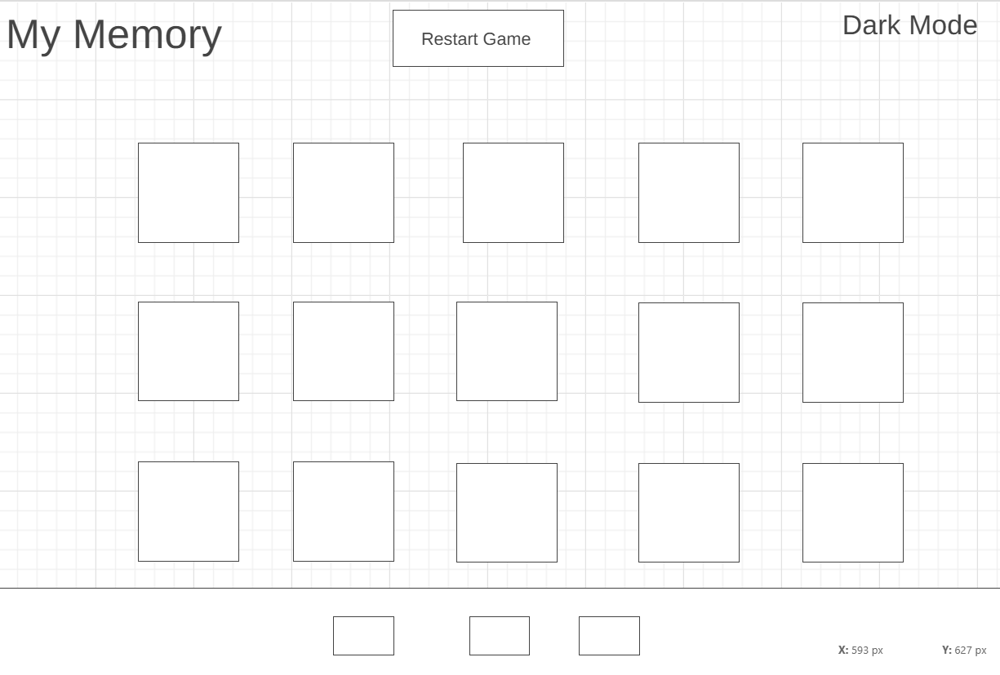

### Home Page Smaller Device Wireframe

> The is the top view of the page.
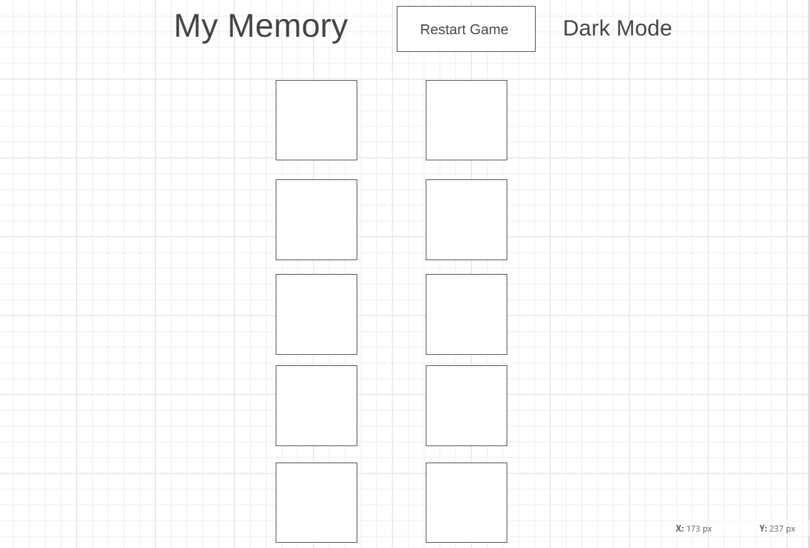

> This is the bottom view of the page
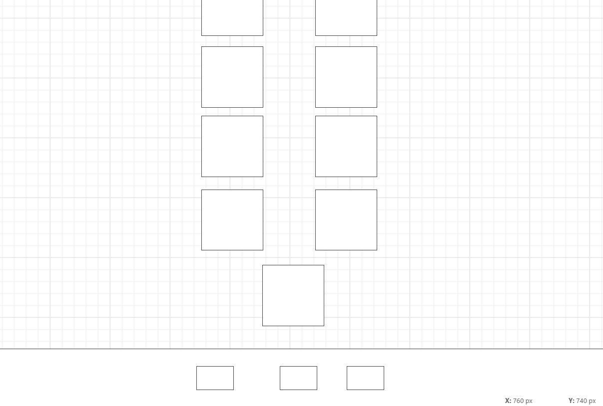

> The design I have implemented in the wire frame is in aim of making the game simple, responsive and user friendly.
> The image on the back of the cards (the image displayed before turning) has been created by me with the help of some free images sourced, the images sourced will be referenced in the relevant section.

## Surface Plane

### Color
> I decided for this project that to make it stand out and to give the users an enjoyable expeirence, that color was required. Each card has a different picture whcih allows for a variety of colors to be shown in aim of making the game enjoyable.

> The decision on colors that I made was to ensure that the site appears user friendly and that the colors do not contrast with eachother. 

 - #color 
>rgba(255, 255, 255, 0.8);
>rgb(7, 7, 7);
>rgb(255, 255, 255);
>rgb(249, 9, 9);
>rgb(34, 34, 34);
>rgb(221, 221, 221);
>rgb(51, 51, 51);
>>rgb(255, 255, 255);
>rgb(255, 0, 0);
>rgb(38, 0, 255);
>rgb(37, 6, 241);
>rgba(0, 0, 0, 0.7);
>rgb(249, 9, 9);
>rgb(220, 62, 30);

>These colors allow each part of my page to stand out which allow for user enjoyability. The abiltiy to toggle from dark to light mode also allows for user enjoyabiltiy and accessibility.
>The images within this project allow for a variety of different colors which alows them to stand out from the page. There does appear to be a large amount of color used, however, these colors contain multiple different shades of each to allow for the hover affect and a slight color variation upon the screen turning dark.

### Typography - 

>The font's chosen for this project were:
Roboto with a back up of San-Serif
 - 
> The idea behind this choice was to allow for a readable font with the necessary precaution to use San-Serif if the browser does not support Roboto.

## Features

### index.html

#### Home Page
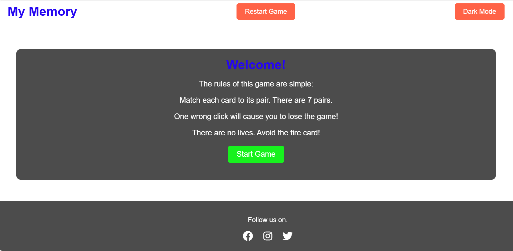
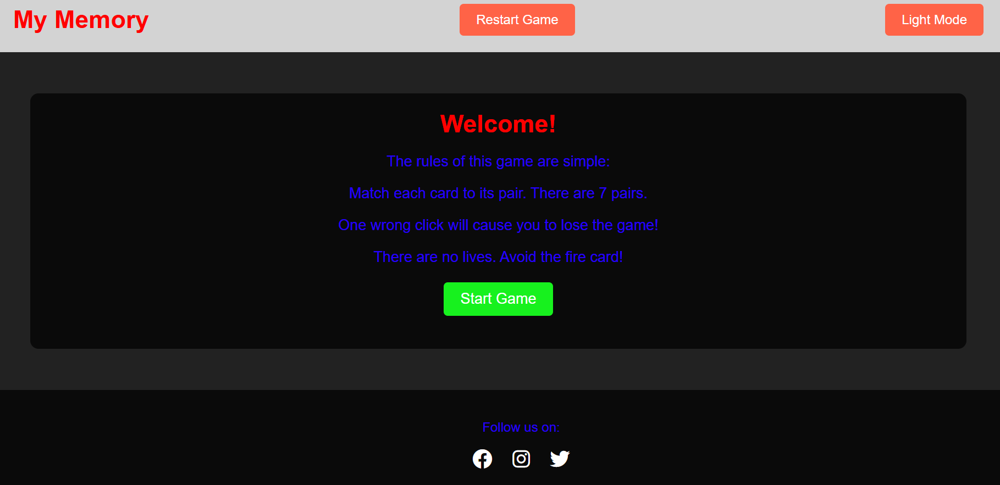
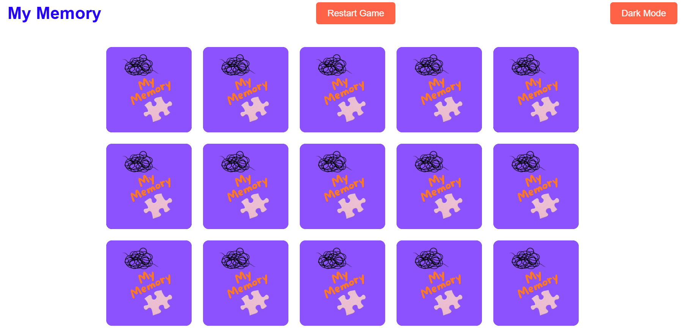
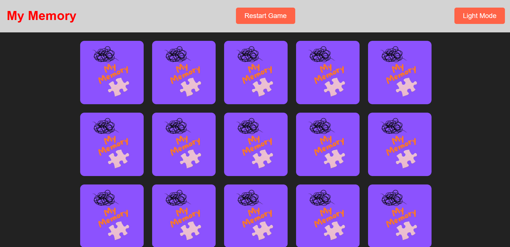
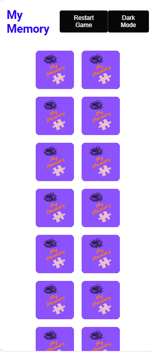
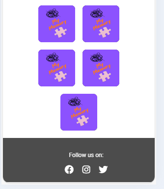

> The Home Page is developed with a heading 1 and a button to toggle dark and light mode with a second button to restart the game. The restart button returns the user to the start with the instructions displayed at a click. The body layout comprises of 15 playing cards which turn when clicked. The back of the flip cards are initially shown to the user, these contain a personalised picture comprised of 2 images and a title. the images were sourced and the title was created by me, these were then made into one image. The reverse of the cards (front) showcase pictures, each picture is shown twice on different cards, there is a tractor, car, motorbike, boat,bus, train and lorry. There is also one odd card which contains a picture of a flame, if this card is selected, the game ends and the usr fails. THe idea of the game is to match all 7 pairs without clikcing the flame card. These scan show that the game has followed what my users wanted, it allows for a fun and easy game which is also challenging. It allows for easy play on your mobile device and it allows for the game to be played over without the knowing of where the cards are.

#### Footer
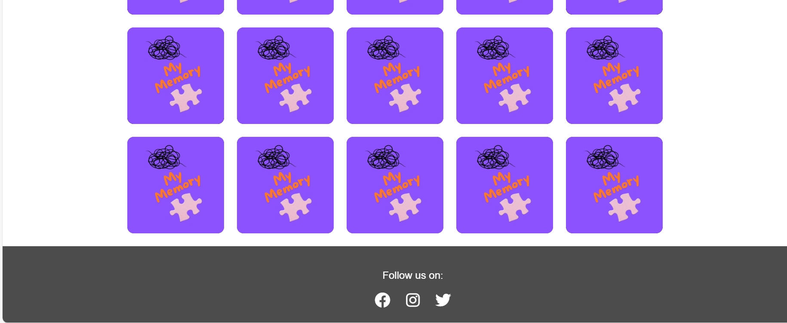

> The footer is a simple footer with 3 i class elements using font-awesome icons. These icons are links to social media accounts (facebook, instagrem and twitter).

#### You Win alert
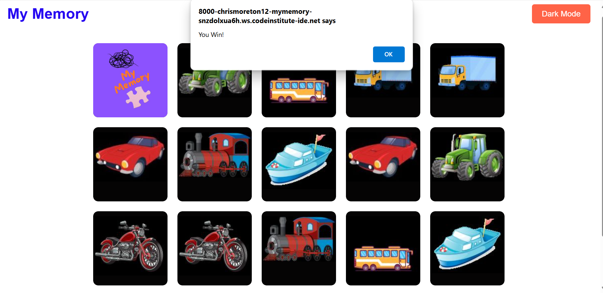

> This is the alert which pops up if you win the game.

#### You Failed alert
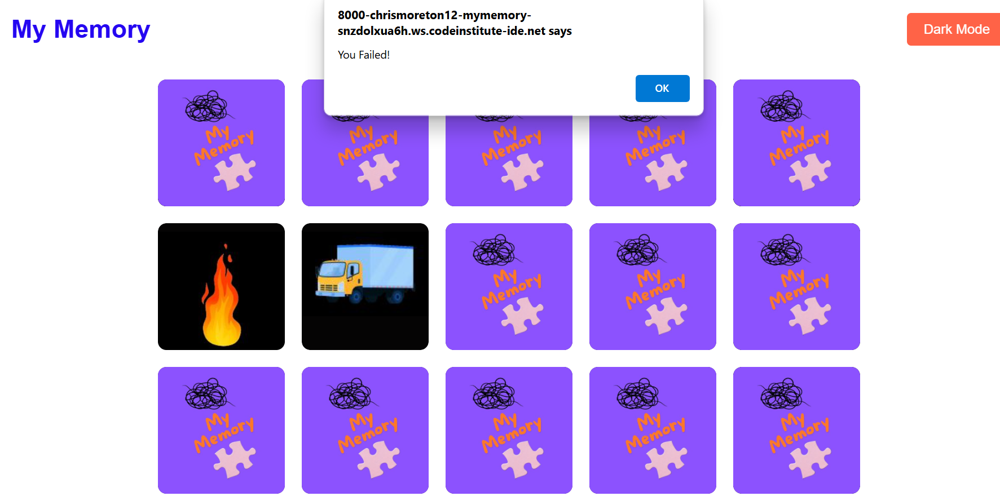

> This is the alert which pops up if you fail the game.

# Features Left to implement

#### Background Section
> In the future I would like to include a second background section with a link to this in the header. This will include different games / a differnt version of the game. This will give the user more of a choice on games to play and can lead to an overall better enjoyment of my game site.

# Technology Used

### Html
> Used to structure my webpage.

### CSS
> Used to style and add layout to my project.

### Font Awesome
> Used for all the icons in this project.

### GoogleFonts
> Used for the fonts in this project and comparison of potential fonts.

### https://www.freeconvert.com
> Used to convert files from png to webp to reduce size and improve web loading speed.

### www.freepik.com
> Used for royalty free images for my webpage.

### www.remove.bg
> Used to remove the backgound on images sourced.

### Jquery
> Used for styling the flip cards for the game.

### www.stackoverflow.com 
> Used for obtaining some code code for jquery to adapt.

### www.W3schools.com 
> Used for checking the vlidation of HTML and CSS.

### Lighthouse
> Used to check the performance, accessibliy and best practices of my site.

# Testing
> Testing on this site was primarily completed by myself and collegues within my workplace. Each new commit allowed for a new test to be completed. After each major change, this change was manually checked by me to ensure that it worked as expected. This meant that each session of coding, there were multiple tests completed. Manual tests were also completed by collegues at work who gave thier suggestions and their input in the game.

### Testing Phase

**Testing for game function and links**
| Test |Outcome  |
|--|--|
|The toggle dark button allowed the screen to be turned dark / light at the click of the button| Pass
|Footer social links all lead to their respective social media sites |Pass|
|Ony a maximum of 2 cards could be clicked at any one time| Pass|
|If the cards match, they remained turned| Pass|
|If the cards do not match, they turn back to their original state| Pass|
|If the flame card is clicked, the site pops up an alert to state you failed and the user clicks ok to return to the welcome message| Pass|
|If the user matches all 7 pairs, the game pops up an alert to state you win| Pass|
|The restart button in the header led the user back to the start welcome message| Pass  |

**Testing for responsiveness**
| Test |Outcome  |
|--|--|
|Test to see if the default layout of the cards is in 3 rows of 5|Pass |
|Test to see if on small screens, the cards adjust to dispalay in rows of two with the last odd card centered for aesthetic purposes |Pass |

### User testing

**User testing Challenge**

> 3 users are given tasks to complete when visiting the game site.

| Test | Result |
|--|--|
|When entering the site, ensure that the game rules pop up.| 100%|
|Please press the toggle dark button to check if the screen goes into dark mode|100%  |
|Please click on the cards to ensure that only 2 cards turn, also make sure that if they match that they remain turned| 100%|
|Please search for the flame card to see if it resets the game after an alert pops up| 100%  |
|Please aim to complete the game and see if an alert pops up to say you win| 100%  |

> 3 users were asked to view the website on their mobile devices and/or tablets to provide any feedback on errors or page issues.

| Test | Result |
|--|--|
|Issues Reported| None|

**User testing suggestions**

> User one - Suggested that I should use emoji images to make the game harder to distinguish between the pictures.

> User two - Suggested that I should add another page to allow for more versions of the game to be made.

> User three - Suggested that I should add more cards to make the initial game longer / harder.

## Google Lighthouse Testing

### index.html
> Initial lighthouse check.

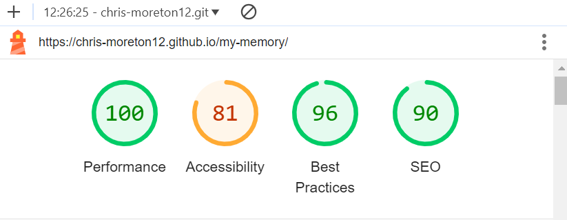

>Updated lighthouse check. Updated the meta descrittion, updated colors for better contrast, updated alts for images, added aria-label for social media links. This increased my lighthouse score.

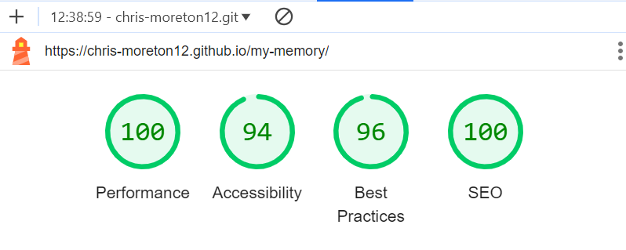

>Individual scans.

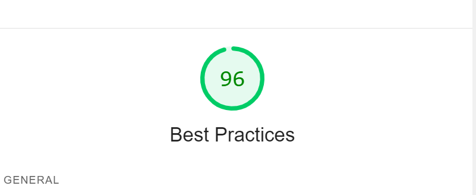

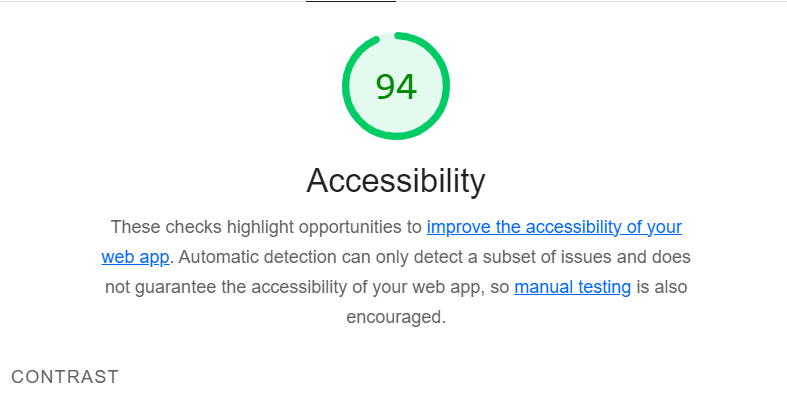

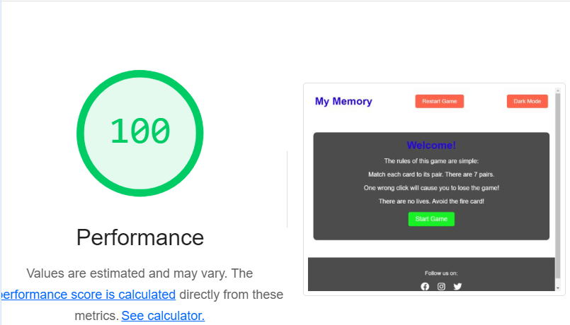

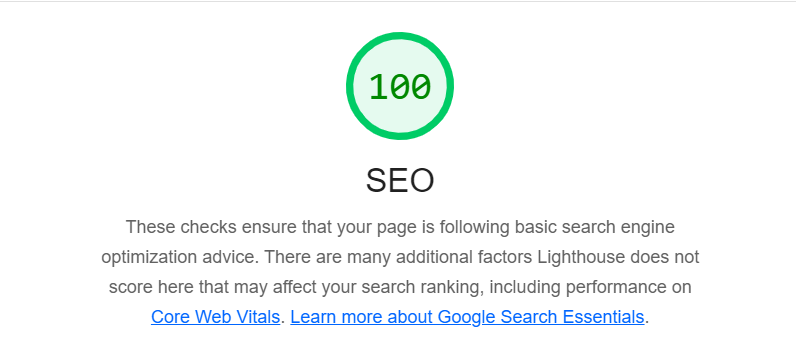

## HTML Validation

### index.html
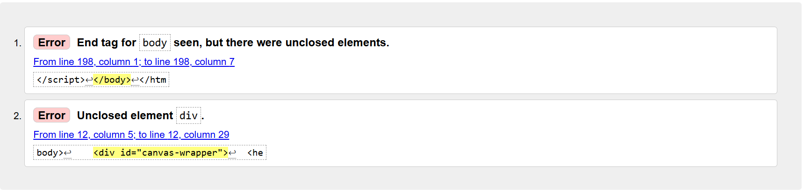
#### Result: Error flagged regarding closing tag. HTML checked and closing tag is present.

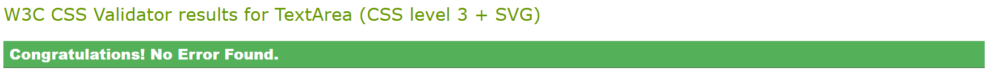
#### Result: No Errors

## **Bugs**
> Bug with the footer not sticking to the bottom of the page. Canvas wrapper used to ensure that the footer would remian at the bottom of the page. **fixed**

> Bug with footer not covering the width of the viewport. Edited nd ensure tht footer covers 100% of viewport width. **fixed**

> Bug wit hresponsive design, on Ipad size, the page did not display anything. Adjusted and edited the responsive design screen sizes and bug was fixed. **fixed**

> Bug with jquery not allowing the cards to flip / when they flipped they just mirrorer my original back of card. Edited the classes of the images to ensure that the image you see on default is the back of the card and the image when turned is the front of the card. Added a .card-back class to the roate y 180 deg. **fixed**

> Bug with the fail alert only appearing after two cards are clicked. Moved the line of jquery code to line after 48. Ensured the code was writtne to state that if the card has class fire to restart the game after displaying the alert.  **fixed**

## Deployment

> To deploy the project I followed these steps starting from the main project repository [here](https://github.com/Chris-moreton12/).

 1. Clicked on `Settings` on the navigation menu in the repository
 2. I then selected the `Pages` menu on the side bar.
 3. In the first dropdown menu labeled `Source` I selected the branch of the name `main` from the dropdown.
 4. In the next dropdown labeled `/root` I left as the default option.
 5. Selected Save

 > I then received a notification from GitHub that my project is being deployed and after about 2 minutes and a some page refreshes it was ready and live.

 
## Credits

### All images sourced from freepik.com. Links for images included below;

>  Card back image: https://www.freepik.com/free-vector/doodle-tangled-scribble_134996330.htm#fromView=image_search_similar&page=1&position=6&uuid=e7ab6ad1-6141-4daa-bb99-a3763c81433f  
https://www.freepik.com/free-photo/close-up-pink-jigsaw-puzzle-piece-blue-background_5015048.htm#fromView=search&page=1&position=24&uuid=d7a0b8f1-0a65-4a61-b9a9-4d11f943ec40    

> Memory card car: https://www.freepik.com/free-psd/cartoon-modern-car-illustration_137972561.htm#query=cartoon%20cars&position=6&from_view=keyword&track=ais_hybrid&uuid=997be9dd-60a3-4c1a-bf54-aad53828d273    

> Memory card tractor: https://www.freepik.com/free-vector/green-tractor-with-big-wheels_22746642.htm#fromView=search&page=1&position=2&uuid=3e2cb8ab-fe59-4b23-bc7e-2eeb26ffb850 

> Memory card bus: https://www.freepik.com/free-vector/bus-cartoon-icon-illustration_10340598.htm#fromView=search&page=1&position=3&uuid=3fec54a6-19af-4e8f-9ec2-2cfa7d55fe7c

> Memory card motor bike: https://www.freepik.com/free-vector/red-color-motorcycle-isolated-white-background_9648067.htm#fromView=search&page=1&position=1&uuid=6d403e30-04a6-4274-9936-b5af04c30cc2

> Memory card train: https://www.freepik.com/free-vector/steam-locomotive-train-vintage-style_26348426.htm#fromView=search&page=1&position=28&uuid=b3fa9bf5-0f4f-4761-afbd-ec5b1721d662

> Memory card lorry: https://www.freepik.com/free-vector/hand-drawn-transport-truck_20289254.htm#fromView=search&page=2&position=14&uuid=d9dc4ca9-c8b4-4774-a7e7-c8e4b96a0597

> Memory card boat: https://www.freepik.com/free-vector/object-illustration_1553577.htm#fromView=search&page=1&position=36&uuid=9e2c5c73-ec7b-4c4a-b133-ff0a14532149

> Memory card fire: https://www.freepik.com/free-psd/fire-element-illustration_42064069.htm#fromView=search&page=1&position=1&uuid=c01ae487-0bf9-4a8d-bcba-f6070303cd92

## Content & Resources

### https://wireframe.cc
> Used to create the wireframes for this game.

### https://validator.w3.org/
> W3C validator to check HTML validation.

### https://jigsaw.w3.org/css-validator/
> W3C validator for CSS validation.

### https://www.w3schools.com/
> Overall aid with coding.

### Stack overflow

### https://stackoverflow.com/questions/10809995/css-disable-text-selection -disable visual search hover
>This was used to disable the image visual search hover.

> ### https://stackoverflow.com/questions/56511466 how-to-create-a-jquery-function-to-toggle-dark-mode
>This was used to aid with the toggle dark mode button.

### https://stackoverflow.com/questions/46276793/how-to-center-elements-on-the-last-row-in-css-grid 
>This was used to aid centering the odd card when in smaller screen mode.

### https://stackoverflow.com/questions/73603123/function-for-shuffling-a-deck-of-cards-js#:~:text=So%20an%20easier%20way%20to%20shuffle 
>This was used to aid with the shuffling of the cards randomly at the start of each game.

### https://stackoverflow.com/questions/2804157/how-to-alert-using-jquery#:~:text=3%20Answers.%20Sorted%20by:%2093.%20$(%22.overdue%22).each 
>This was ued to aid in creating the alerts for the win and fail.

### https://www.freeconvert.com/jpg-to-webp

> This was used to convert the images from JPEG to WEBP for faster loading time due to smaller compressed images.

### https://www.remove.bg/upload
> This was used to remove the background off of the images sourced.

### https://codepen.io/SH20RAJ/pen/bGZyzmE
> This was used as an overall aid for building the memory card game.

### https://fontawesome.com/
> This ws used for the footer icons for social media links.

## Acknowledgements

### Sheryl Goldberg
> My mentor who helped me with constructive feedback and ensured my project submission time was met with help on some bugs and functionality.

### Miguel Ortega Legorreta
> My Tutor who supported me to reach on time submission.

